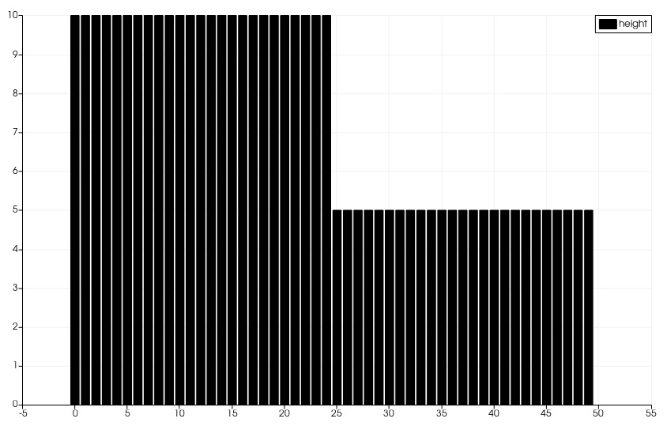

.. _ch:Task_1.1:

Report Week 1
==============
To implement the f-wave solver we used a class called F_Wave the only public method of F_Wave is called netUpdates, which calculates all netUpdates as required in the task. To calculate the netUpdates we need to compute each wave first, that again requires the wave speeds and wave strengths to be available. For which we wrote the private functions waveSpeeds and waveStrengths. Lastly we added the heightAvg and the particleVelocityAvg function to be able to calculate the wave speeds. 

Both heightAvg, which calculates average height of the left and the right cell, and particleVelocityAvg, computing the average particle velocity of both cells, are implemented as extra functions to increase readability.
This chapter implements and tests the most basic part of our project: The *f-wave* solver for the one-dimensional shallow water equations.
The shallow water equations are a system of nonlinear hyperbolic conservations laws with an optional source term:

.. math:: h(q_l, q_r) = \frac{1}{2}(h_l+h_r), u(q_l, q_r) = \frac{u_l\sqrt{h_l}+u_r\sqrt{h_r}}{\sqrt{h_l}+\sqrt{h_r}}.

The waveSpeeds function computes the roe eigenvalues (wave speeds of both waves) using the average height, average particle velocity and the gravity constant g.

.. math:: \lambda_{1, 2}=u(q_l, q_r)\mp\sqrt{g\cdot h(q_l, q_r)}

The waveStrengths function computes the wave strengths of both waves.

.. math:: \begin{bmatrix}\alpha_1 \\ \alpha_2 \end{bmatrix} = \begin{bmatrix}1 & 1\\ \lambda_1 & \lambda_2\end{bmatrix}^{-1}\Delta f 

To increase the readability we used the Variable inv_det that stores the inverse determinant.

.. math:: \frac{1}{\lambda_2-\lambda_1}\begin{bmatrix}\lambda_2 & -1\\ -\lambda_1 & 1\end{bmatrix} = \begin{bmatrix}\lambda_2\cdot inv\_det & -inv\_det\\ -\lambda_1\cdot inv\_det & inv\_det\end{bmatrix}\qquad

When we wrote out the matrix-vector multiplication we got formulas for each wave strength, which can be calculated easily by a computer.

.. math:: \alpha_1 = \lambda_2\cdot inv\_det\cdot (h_l- h_r) - inv\_det\cdot(hu_l-hu_r),\\ \alpha_2 = inv\_det\cdot(hu_l-hu_r)-\lambda_1\cdot inv\_det\cdot(h_l-h_r)

If the wave strength is greater than 0 it belongs to a wave is right-going which influences the right cell. And the other way around. We expect one wave to be right-going and on to be left-going. This way the left net update equals the left-going wave and the right net update is set to be the right going wave.

.. math:: netUpdate_{Left}= A^{-}\Delta Q = \begin{cases}Z_1\qquad\lambda_1<0\\ Z_2\qquad\lambda_2<0\end{cases} \\ netUpdate_{Right}= A^{+}\Delta Q = \begin{cases}Z_1\qquad\lambda_1>0\\ Z_2\qquad\lambda_2>0\end{cases} 

.. _ch:code:

Code
---------------

